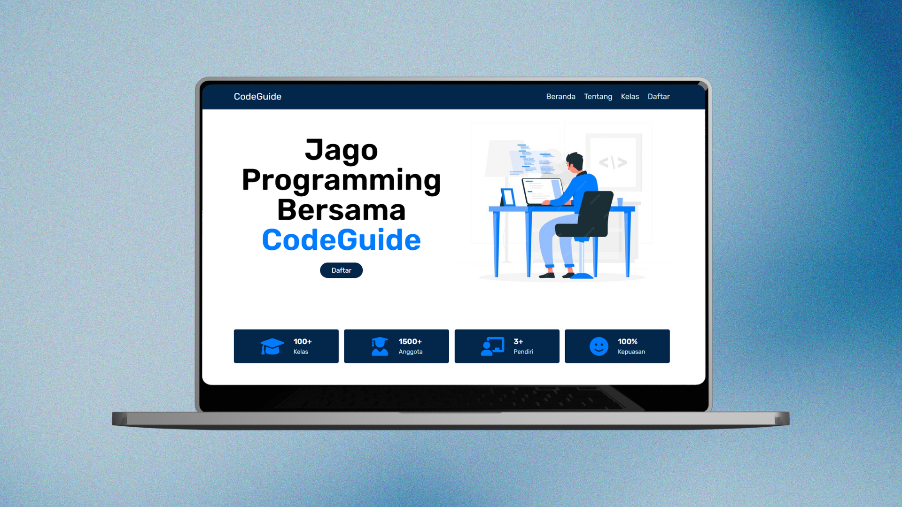

# CodeGuide
<!-- PROJECT LOGO -->
 

  <h3 align="center">Code Guide</h3>

  

   CodeGuide is a website for learning programming that can also interact with fellow programming lovers.
     
  

<!-- ABOUT THE PROJECT -->
## About The Project

  

 
This project is a simple project that displays the CodeGuide website with main pages containing general information such as Home, About, Classes, and Register.

<!-- GETTING STARTED -->
## Getting Started

## Open The Project
1.  Open XAMPP and click “Start” on the MySQL module
2. Move the project file to C:\xampp\htdocs
3. Open a browser and go to http://localhost/CodeGuide/index.html
   

(<a href="#readme-top">back to top</a>)

